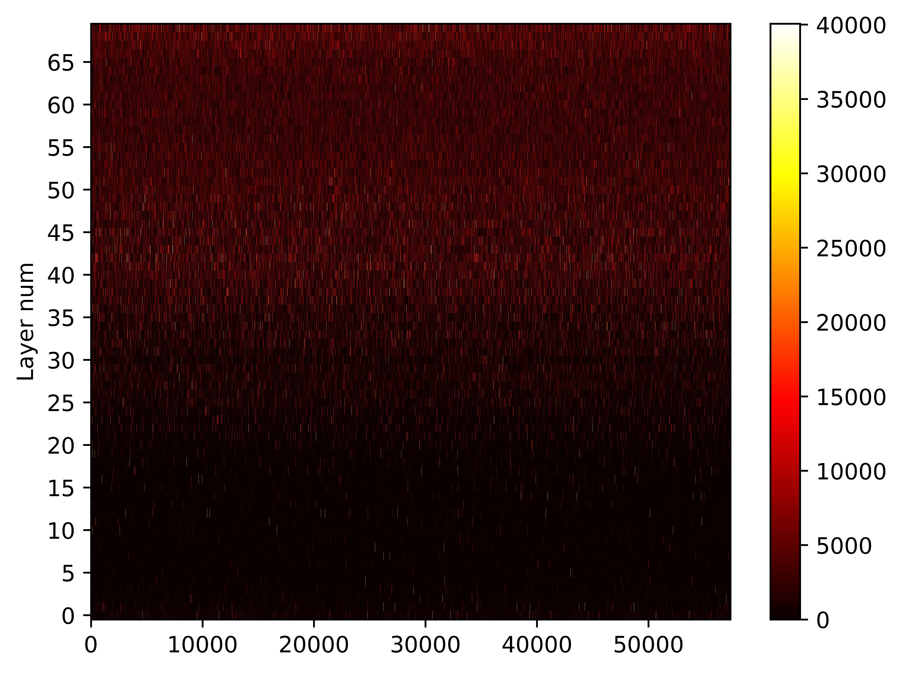
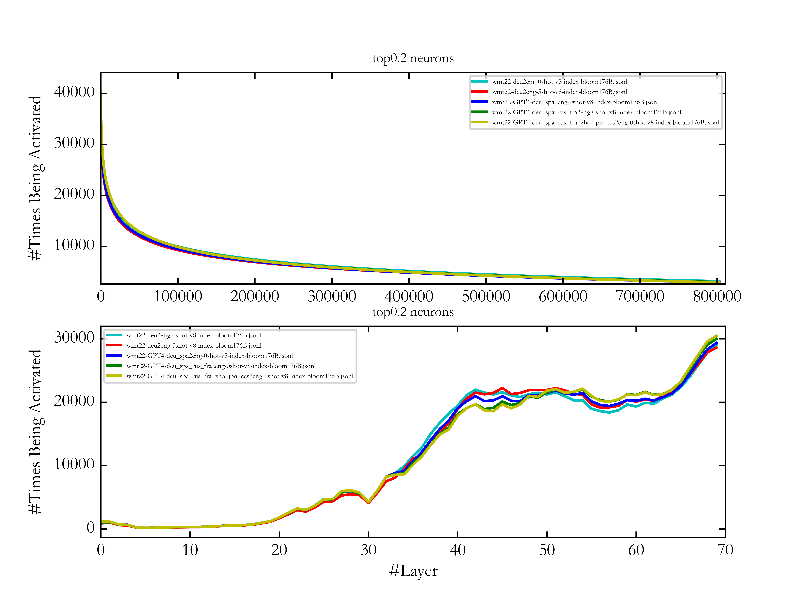

# Revealing the Parallel Multilingual Learning within Large Language Models
The code of the paper-[Revealing the Parallel Multilingual Learning within Large Language Models](https://arxiv.org/abs/2403.09073) includes two parts. The first one is counting activated neurons in the multi-layer perceptrons (MLPs) of transformer models. The second one is fine-tuning and inference.

## 1 Requirements and Installation
- LLaMA-Factory >= 0.3.2

To do fine-tuning and inference on the multilingual LLMs used in our work, you may need to create an environment satisfying the requirements of [LLaMA-Factory](https://github.com/hiyouga/LLaMA-Factory/tree/v0.3.2).

## 2 Parallel Multilingual Data
The parallel multilingual data translated by GPTs is released in ```gpt_translated_data/specific dataset```. The datasets used in our experiments are detailed in the following table. Note that all the samples are randomly selected to guarantee the effectiveness of the evaluations. Except for the FLORES-200 and XNLI development set which is already parallel in multiple languages, other datasets are translated by GPTs. 

Task | Evaluation Dataset | Training Set | Test Set | Translation System
---|---|---|---|---
Translation | WMT | [FLORES-200](https://github.com/facebookresearch/flores/tree/main/flores200) development set | [WMT22](https://github.com/wmt-conference/wmt22-news-systems) (de2en, zh2en, de2fr, en2de, en2zh) and [WMT21](https://github.com/wmt-conference/wmt21-news-systems) (is2en) | GPT4
Nature Language Inference | [RTE](https://dl.fbaipublicfiles.com/glue/data/RTE.zip) | same data as below | RTE devlopment set | ChatGPT
Nature Language Inference | [XNLI](https://cims.nyu.edu/~sbowman/xnli/) | XNLI development set | 1000 samples of the XNLI test set for each language (fr, de, ru, zh) | ChatGPT
Reading Comprehension | [BoolQ](https://github.com/google-research-datasets/boolean-questions) | 1000 samples of the BoolQ training set | 1000 samples of the BoolQ development set | ChatGPT
Text Simplification | [Wiki-Auto](https://github.com/chaojiang06/wiki-auto/blob/master/wiki-auto/GEM2021/full_with_split/valid.tsv) | same data as above | 1000 samples of the Wiki-Auto development set | ChatGPT
Abstractive Summarization | [XLSum](https://github.com/csebuetnlp/xl-sum) | 300 samples of the XLSum development set for each language | 500 samples of the XLSum test set for each language (fr, ru, es) | ChatGPT
Mathematical Reasoning | [GSM8K](https://huggingface.co/datasets/openai/gsm8k/viewer/main/test) | - | GSM8K test set | GPT4

## 3 Statistics of Activated Neurons

To determine the number of activated neurons, we need to analyze the intermediate results generated by MLPs during inference. This process involves modifying the ***modeling*** files to enable MLPs to record intermediate status (Section 3.1), running inference and writing the status into files (Section 3.2), and finally reading the result files for analysis (Sections 3.3-3.5). It's worth noting that during this process, the Qwen models we used are finetuned (Section 4), while the Bloomz models are not. Since the MLPs of Qwen are in the same architecture as those of LLaMA-2, you can duplicate the modification of ```modeling_qwen.py``` to ```modeling_llama.py``` and count LLaMA's activated neurons.

### 3.1 Modification of ***modeling*** Files 
To obtain intermediate result files, we replace the original ***modeling*** files with those we have modified. The modified ***modeling*** files we used for Bloomz and Qwen models are provided under ```./counting_activated_neurons/modeling/```. The script below is an example of a replacement:

```bash
# Replace Bloomz modeling file
mv transformers/src/transformers/models/bloom/modeling_bloom.py transformers/src/transformers/models/bloom/modeling_bloom_ori.py     # Back up the original modeling file
cp ./counting_activated_neurons/modeling/modeling_bloom.py transformers/src/transformers/models/bloom/
```

### 3.2 Inference
Run the script ```./counting_activated_neurons/activate/infer_activate.py``` to do inference. Three output files can be obtained from this process: the *model generation result* file, the *activated neuron proportion of each layer* file, and the *activated neuron status of each position* file.

Description of parameters in the script:
```python
os.environ['CUDA_VISIBLE_DEVICES']=""     # specify GPUs to be used
checkpoint = ""     # path of model
file_name = ""     # name of input file（not include file suffix）
input_file = f"{file_name}.txt"     # path of input file
activate_proportion_file = f"{file_name}-proportion-{checkpoint}.jsonl"     # path of the activated neurons proportion of each layer file
activate_index_file = f"{file_name}-index-{checkpoint}.jsonl"     # path of the activated neurons status of each position file
output_file = f"{file_name}-result-{checkpoint}.txt"     # path of the model generation result file
sys_prompt_flag = False     # Additional prompt settings, True to use sys_prompt, False to not use additional prompts
sys_prompt = "<|im_start|>system\nYou are a helpful assistant.<|im_end|>\n<|im_start|>user\n<|custom|><|im_end|>\n<|im_start|>assistant\n"     # the <| custom |> will be replaced with input information
interactivate_flag = False     # interactive mode settings, True to use interactive mode, False to use read file mode
```

Run:
```bash
python ./counting_activated_neurons/activate/infer_activate.py
```

### 3.3 Analysis of Activated Neurons Proportion of Each Layer
Run the ```./counting_activated_neurons/activate/Proportion_analysis.py``` script to analyze the *activated neurons proportion of each layer* file and obtain the final results. The results include the proportion of inhibited neurons in each layer and the total average inhibition proportion.

Description of script parameters:
```python
input_file = ''     # the activated neurons proportion of each layer file generated during the inference process
```

Run:
```bash
python ./counting_activated_neurons/activate/Proportion_analysis.py
```

### 3.4 Visualization of All Activated Neurons
Run the ```./counting_activated_neurons/HeatMap_analysis.py``` script to visualize the activated neurons' distribution with a heatmap.

Description of script parameters:
```python
file = ""     # the activated neurons status of each position file generated during the inference process
```

Run:
```bash
python ./counting_activated_neurons/activate/HeatMap_analysis.py
```

Results:



### 3.5 Analysis of High-frequency Activated Neurons
Run the ```./counting_activated_neurons/Peak_analysis.py``` script to make line graphs of the number and the distribution of high-frequency activated neurons in each layer.

Description of script parameters:
```python
file_list = []     # input file list, the number of lists can be 1
select_proportion = 0.2     # Select the proportion of neurons, for example, if set to 0.2, it means selecting the top 20% of neurons with activation count
```

Run:
```bash
python ./counting_activated_neurons/activate/Peak_analysis.py
```

Results:




## 4 Fine-tuning and Inference
We use LLaMA-Factory and their official code to do fine-tuning and inference, which is detailed in the table below. The setup of fine-tuning and inference is provided in the appendix of our paper.

Model | LoRA tuning or Not | Tool of Fine-tuning and Inference
---|---|---
ChatGPT | N | [OpenAI's API](https://platform.openai.com/docs/api-reference)
Qwen-7B | Y | [LLaMA-Factory](https://github.com/hiyouga/LLaMA-Factory/tree/v0.3.2)
Qwen-14B | Y | LLaMA-Factory
Qwen-72B | Y | LLaMA-Factory
ALMA-13B | Y | LLaMA-Factory
mT0-13B | N | [offical code](https://huggingface.co/bigscience/mt0-xxl)
Yi-34B | Y | LLaMA-Factory
Bloomz-176B | N | [offical code](https://huggingface.co/bigscience/bloomz)

The code we used for making fine-tuning and inference data is provided in ```fine-tuning_and_inference```.

## Citation
If this work is helpful for your research, please consider citing the following BibTeX entry.
```
@article{mu2024large,
  title={Large Language Models are Parallel Multilingual Learners},
  author={Mu, Yongyu and Feng, Peinan and Cao, Zhiquan and Wu, Yuzhang and Li, Bei and Wang, Chenglong and Xiao, Tong and Song, Kai and Liu, Tongran and Zhang, Chunliang and others},
  journal={arXiv preprint arXiv:2403.09073},
  year={2024}
}
```
