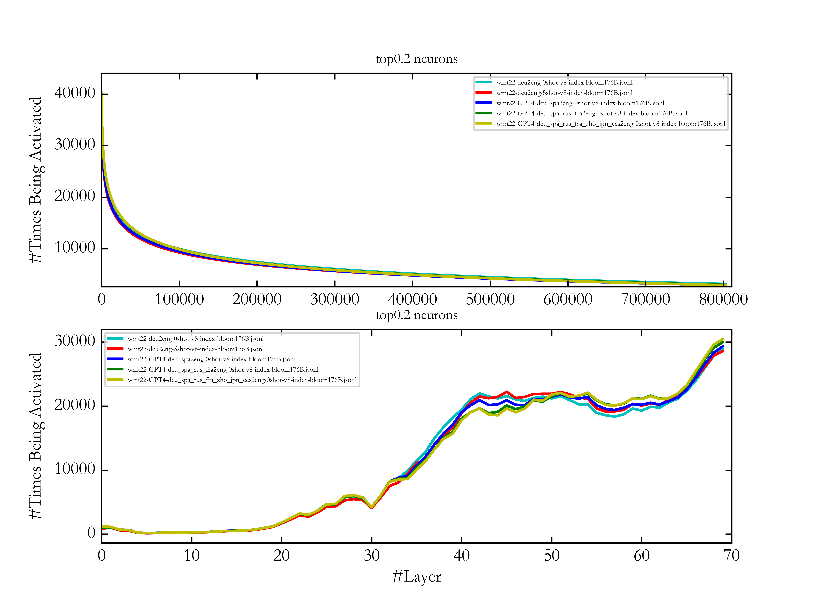

# Large Language Models are parallel multilingual learners
The code of the paper-[Large Language Models are Parallel Multilingual Learners]() is consisting of two parts. The first one is counting activated neurons in the multi-layer perceptrons (MLPs) of transformer models. The second one is fine-tuning and inference.

## 1 Requirements and Installation
- LLaMA-Factory >= 0.3.2

To do fine-tuning and inference on the multilingual LLMs used in our work, all you need is to create an environment satisfying the needs of [LLaMA-Factory](https://github.com/hiyouga/LLaMA-Factory/tree/v0.3.2).

## 2 Parallel multilingual Data
The parallel multilingual data translated by GPTs is released in ```gpt_translated_data/specific dataset```. The dataset used in our work is detailed in the following table. Note that all samples are randomly selected to guarantee the effectiveness of the evaluations. Except for the FLORES-200 and XNLI development set which is already parallel in multiple languages, other datasets are translated by GPTs. 

Task | Evaluation Dataset | Training Set | Test Set | Translation System
---|---|---|---|---
Translation | WMT | [FLORES-200](https://github.com/facebookresearch/flores/tree/main/flores200) development set | [WMT22](https://github.com/wmt-conference/wmt22-news-systems) (de2en, zh2en, de2fr, en2de, en2zh) and [WMT21](https://github.com/wmt-conference/wmt21-news-systems) (is2en) | GPT4
Nature Language Inference | [RTE](https://dl.fbaipublicfiles.com/glue/data/RTE.zip) | same data as below | RTE devlopment set | ChatGPT
Nature Language Inference | [XNLI](https://cims.nyu.edu/~sbowman/xnli/) | XNLI development set | 1000 samples of the XNLI test set for each language (fr, de, ru, zh) | ChatGPT
Reading Comprehension | [BoolQ](https://github.com/google-research-datasets/boolean-questions) | 1000 samples of the BoolQ training set | 1000 samples of the BoolQ development set | ChatGPT
Text Simplification | [Asset](https://github.com/facebookresearch/asset) | 2000 samples of the Asset development set | Asset test set | ChatGPT
Text Simplification | [Wiki-Auto](https://github.com/chaojiang06/wiki-auto/blob/master/wiki-auto/GEM2021/full_with_split/valid.tsv) | same data as above | 1000 samples of the Wiki-Auto development set | ChatGPT
Abstractive Summarization | [XLSum](https://github.com/csebuetnlp/xl-sum) | 300 samples of the XLSum development set for each language | 500 samples of the XLSum test set for each language (fr, ru, es) | ChatGPT

## 3 Statistics of Activated Neurons

During the inference stage, the intermediate result of MLPs stands for an activation state of neurons. So we realize the statistics of activated neurons by counting the intermediate result of MLPs. The overall process is as follows: we first modify the ***modeling*** file to support the statistics of MLP intermediate state(3.1), then infer and write the neurons activation state to the file(3.2), and finally read the intermediate result file for analysis(3.3-3.5). It is worth noting that, in this process, the Qwen models we use are finetuned(4), while the Bloomz models are not. 

### 3.1 Modification of ***modeling*** File 
The modified ***modeling*** files for Bloomz and Qwen models are provided under ./counting_activated_neurons/modeling/. In order to count the activated neurons, the original modeling file needs to be replaced. Below is an example of replacement:

```bash
# Replace Bloomz modeling file
mv transformers/src/transformers/models/bloom/modeling_bloom.py transformers/src/transformers/models/bloom/modeling_bloom_ori.py     # Back up the original modeling file
cp ./counting_activated_neurons/modeling/modeling_bloom.py transformers/src/transformers/models/bloom/
```

### 3.2 Inference
Using script ./counting_activated_neurons/activate/infer_activate.py to inference, three files can be obtained, including the *model generation result file*, the *activated neurons ratio of each layer file*, and the *activated neurons status of each position file*.

Description of script parameters
```python
os.environ['CUDA_VISIBLE_DEVICES']=""     # specify GPUs to be used
checkpoint = ""     # path of model
file_name = ""     # name of input file（not include file suffix）
input_file = f"{file_name}.txt"     # path of input file
activate_ratio_file = f"{file_name}-ratio-{checkpoint}.jsonl"     # path of the activated neurons ratio of each layer file
activate_index_file = f"{file_name}-index-{checkpoint}.jsonl"     # path of the activated neurons status of each position file
output_file = f"{file_name}-result-{checkpoint}.txt"     # path of the model generation result file
sys_prompt_flag = False     # Additional prompt settings, True to use sys_prompt, False to not use additional prompts
sys_prompt = "<|im_start|>system\nYou are a helpful assistant.<|im_end|>\n<|im_start|>user\n<|custom|><|im_end|>\n<|im_start|>assistant\n"     # the <| custom |> will be replaced with input information
interactivate_flag = False     # interactive mode settings, True to use interactive mode, False to use read file mode
```

Run script
```bash
python ./counting_activated_neurons/activate/infer_activate.py
```

### 3.3 Analysis of Activated Neurons Ratio of Each Layer
Using script ./counting_activated_neurons/activate/Ratio_anasisly.py to analyze the *activated neurons ratio of each layer file*, the final result can be obtained. The final results shows the inhibition ratio of neurons in each layer and the total average inhibition ratio.

Description of script parameters
```python
input_file = ''     # the activated neurons ratio of each layer file generated by the model inference
```

Run script
```bash
python ./counting_activated_neurons/activate/Ratio_anasisly.py
```

### 3.4 Visualization of All Activated Neurons
Using script ./counting_activated_neurons/HeatMap_anasisly.py to visualize the all activated neurons distribution and form a heatmap.

Description of script parameters
```python
file = ""     # the activated neurons status of each position file generated by the model inference
```

Run script
```bash
python ./counting_activated_neurons/activate/HeatMap_anasisly.py
```

Result display


### 3.5 Analysis of High-frequency Activated Neurons
Using ./counting_activated_neurons/Peak_anasisly.py script to calculate the line graph of the number and the distribution of high-frequency activated neurons in each layer.

Description of script parameters
```python
file_list = []     # input file list, the number of lists can be 1
select_proportion = 0.2     # select the proportion of neurons, for example, if set to 0.2, it means selecting the top 20% of neurons with activation count
```

Run script
```bash
python ./counting_activated_neurons/activate/Peak_anasisly.py
```

Result display




## 4 Fine-tuning and Inference
We used LLaMA-Factory and offical codes to do fine-tuning and inference, which is detailed in the below table. The fine-tuning and inference setups are provided in the appendix of our paper.

Model | Fine-tuning or Not | Tool of Fine-tuning and Inference
---|---|---
ChatGPT | N | [OpenAI's API](https://platform.openai.com/docs/api-reference)
Qwen-7B | Y | [LLaMA-Factory](https://github.com/hiyouga/LLaMA-Factory/tree/v0.3.2)
Qwen-14B | Y | LLaMA-Factory
Qwen-72B | Y | LLaMA-Factory
ALMA-13B | Y | LLaMA-Factory
mT0-13B | N | [offical code](https://huggingface.co/bigscience/mt0-xxl)
Yi-34B | Y | LLaMA-Factory
Bloomz-176B | N | [offical code](https://huggingface.co/bigscience/bloomz)

The demo for making fine-tuning and inference data is located in ```fine-tuning_and_inference```.

<!-- ## Citation
If this work is helpful for your research, please consider citing the following BibTeX entry.
```
``` -->